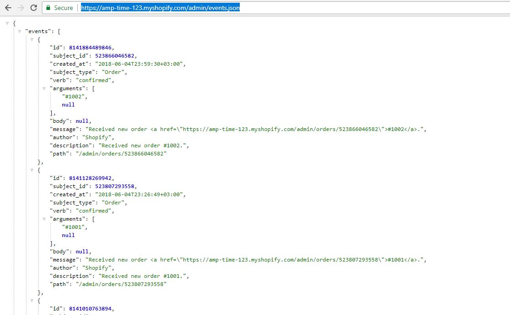
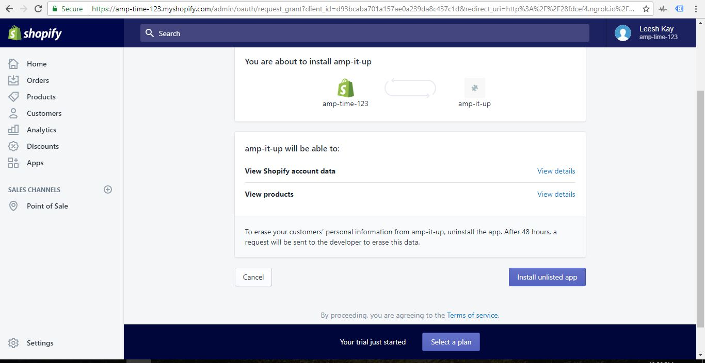

"# shopify-node-express" 

First thing I did to begin this project is to download the Shopify POS App for In-Store Purchases - available on Android. Through the UI, you can easily create a username and password, add products, and even make a purchase. Here's what a purchase looks like via the mobile app:


Next, use the same credentials you used on your mobile in order to login to your app via your web browser. Here's what the same store looks like in your web browser:


Once that is done there are several important routes and ideas to take into account regarding Shopify's REST Admin API:

a) Shopify's API revolves around events. Via the Events object, you can access many other Shopify elements.


b) In this example, my store is named "amp-time-123". Once I've logged into the web platform, I have easy access to all the events occuring on my Shopify POS store. As mentioned above, I made a purchase (2 actually) for shoes that cose 0.22 shekels. Within the browser, I navigate to 

```
https://amp-time-123.myshopify.com/admin/events.json
```

This pulls up the events history (but it's not incredibly detailed).



In order to dig deeper, let's look at the API Call for one specific event: 

```
https://amp-time-123.myshopify.com/admin/events/8141128269942.json
```


Notice that there's a key on the event object called "path". This provides you with a deeper look into the order itself.

If we use that path value as a starting point, we can now get the API Call for a deep picture of a given order / transaction. In this example, it's available at:

```
https://amp-time-123.myshopify.com/admin/orders/523807293558.json

Note: By appending '.json' to the end of the path, we verify that we won't be taken to the standard web-based Shopify UX.

```


<h3>How To Automatically fetch transaction Data</h3>

The next challenge is to automate the process of capturing information happening on each order transaction of a Shopify POS platform.

The higher-level architecture for this challenge is to use the <a href="https://help.shopify.com/api/sdks/shopify-apps/embedded-app-sdk">Embedded App SDK</a> to allow merchants to load your app from within the Shopify admin. But, before you begin playing with the Embedded App SDK, you will need to feel comfortable working with Shopify's Partner Dashboard, and getting a working repo.

For this goal, I followed this <a href="https://help.shopify.com/api/tutorials/building-node-app">online guide for building a shopify app with using NodeJS and Express</a>

There is also a 1-hour <a href="https://www.youtube.com/watch?v=D3iO4mZHgLk&feature=youtu.be">YouTube video covering the same repo and blog article.</a>

Here's the flow once you create an app via Shopify's Partner Dashboard:

<h3>Step 1: Set Up a Forwarding Address with Ngrok</h3>

Shopify doesn't like localhost.


<h3>Step 2: Verify that you choose the POS Option When Creating Your App</h3>


<h3>Step 3: Setup Whitelisted redirection URL's</h3>


<h3>Step 4: NPM Init and Dependencies</h3>


<h3>Step 5: Use the Forwarding URL Ngrock gave you and pass in your Shop name in the url</h3>


<h3>Step 6: You'll be taken to this screen that allows you to grant permission (on behalf of your POS Store), to the app you're setting up</h3>




<h3>Behind the scenes, the server is requesing an Access Token via the Same API mentioned in the first half of this tutorial</h3>

Here's what the Request looks like within the index.js file of this repo (line 73):

```
const accessTokenRequestUrl = 'https://' + shop + '/admin/oauth/access_token';
```


